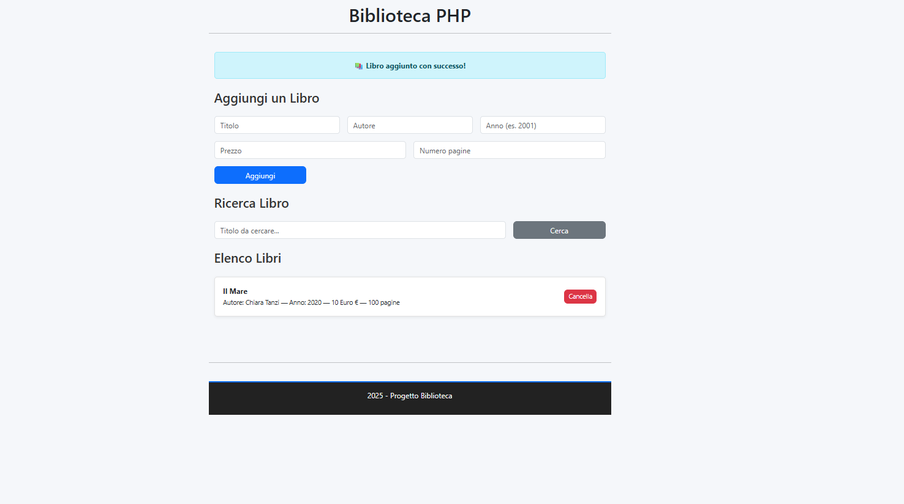
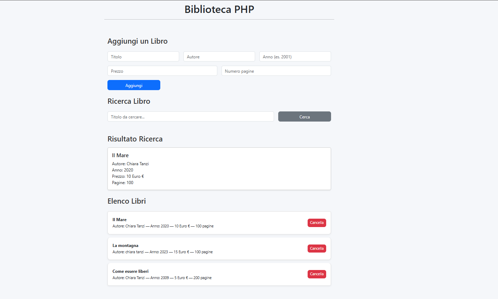
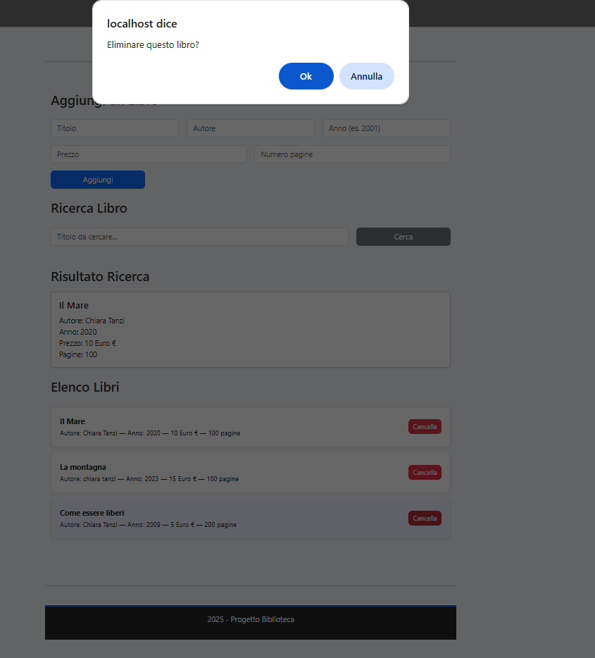

#  📚 Libreria PHP – Gestione Libri

Una semplice libreria scritta in PHP per gestire libri, autori e numero di pagine.
Permette di **aggiungere**, **visualizzare**, **eliminare** un libro.


---

*Novembre 2025*  

*Corso di full stack*  
🧑‍💻 

---

   

   

  


---
🔨
| Nome | Linguaggio    | Versione |
|------|------------   |----------|      
| PHP  | backend       | 8.3      |
| XAMPP| Server locale | 8.x      |


👨‍💻
```bash
Avviare XAMPP
Start APACHE SERVER